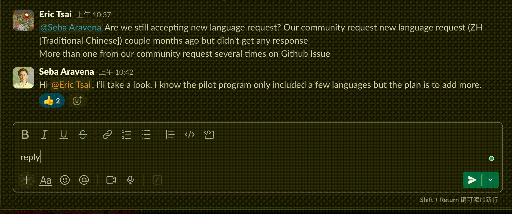
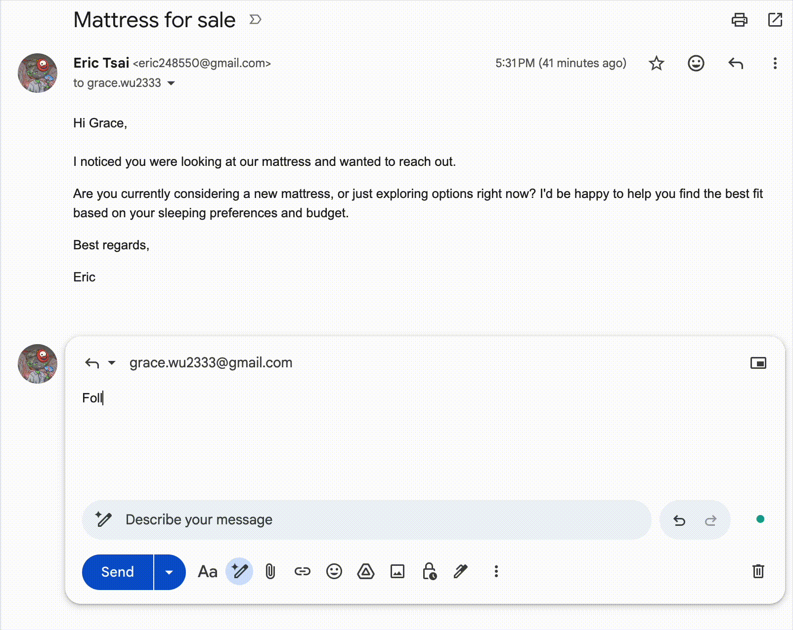

# ComCom

> The AI communication tool for Gmail and Slack.

[](LICENSE)
[](https://nextjs.org)
[](https://workers.cloudflare.com)
[](https://openai.com)
[](https://chromewebstore.google.com/detail/comcom/dpmfokapmmmahdkaphlgodghojcdhigo)

**[🚀 Try the Dashboard](https://comcomweb.vercel.app/)** · **[🧩 Install Chrome Extension](https://chromewebstore.google.com/detail/comcom/dpmfokapmmmahdkaphlgodghojcdhigo)** · If this project helps you, consider giving it a ⭐

A self-hostable Chrome Extension + SaaS monorepo that injects an AI communication toolbar into Gmail and Slack. Select text → pick a rewrite mode → done. Supports custom prompt templates per user/org, streaming responses, and a full writing history.

---

## Demo

| Slack | Gmail |
|---|---|
|  |  |
| Rewrite messages before sending | Compose & reply with AI drafts |

---

## Features

- **Gmail toolbar** — select text in any compose window, get instant AI rewrites (improve, shorten, expand, formal, casual)
- **Custom prompt templates** — save reusable prompts per user or organization
- **Org writing tone** — set a baseline writing style that applies to all rewrites
- **Streaming rewrites** — real-time token streaming via SSE
- **Writing history** — every session saved, browsable in the dashboard
- **Multi-platform ready** — architecture designed to add Slack, LinkedIn, etc. with minimal code

## Web Dashboard

The web app (`apps/web`) is your control center for ComCom. Sign in at `http://localhost:3000` (or your deployed URL) to access it.

### Overview (`/dashboard`)

- **Stats** — prompt template count, rewrites today, total rewrites
- **Recent Rewrites** — last 5 rewrite sessions with mode and date
- **Quick Actions** — shortcuts to create a prompt, configure tone, or install the extension

### Prompt Templates (`/dashboard/prompts`)

Create and manage reusable AI prompts that appear inside the ComCom toolbar in Gmail and Slack.

Each template has:
- **Title** — displayed in the extension toolbar
- **System Prompt** — the instruction sent to the AI. Use `{{variable_name}}` placeholders for dynamic values
- **Variables** — define named placeholders with a label and optional default value
- **Share with organization** — toggle to make the prompt available to all org members

Example system prompt:
```
Rewrite the following email in a {{tone}} tone, keeping it under {{max_words}} words.
```

### Writing History (`/dashboard/history`)

Every rewrite is logged automatically. The history page shows:
- Original text vs. rewritten text side by side
- Rewrite mode (improve, shorten, expand, formal, casual, or custom prompt)
- Source (gmail, slack)
- Timestamp and token usage

### Settings (`/dashboard/settings`)

Set your organization's default writing tone applied to all AI rewrites:
- **Voice** — professional, friendly, casual, authoritative, or empathetic
- **Formality** — formal, semi-formal, or informal
- **Additional instructions** — free-text style rules (e.g. "Always sign off with Best regards. Avoid jargon.")

---

## Architecture

```
Chrome Extension ──────────────────────────────────┐
                                                    ↓
Next.js frontend ──────────────── Cloudflare Worker API
                                         ↓               ↓
                                    OpenAI API       Neon DB (Prisma)
```

**Key principle:** All business logic lives in the Cloudflare Worker. Next.js is frontend-only (no API routes except the Clerk webhook).

## Stack

| Layer | Technology |
|---|---|
| Monorepo | Turborepo + pnpm workspaces |
| Web App | Next.js 14 App Router + TypeScript |
| Backend API | Cloudflare Workers + Hono + TypeScript |
| UI | Tailwind CSS + shadcn/ui |
| Chrome Extension | Plasmo + React + TypeScript |
| Database | PostgreSQL (Neon) via Prisma + Neon adapter |
| Auth | Clerk (JWT verified in Worker) |
| AI | OpenAI API (gpt-4o-mini) |
| Validation | Zod |

## Project Structure

```
comcom/
├── apps/
│   ├── web/              # Next.js frontend (Vercel) — NO API routes
│   ├── worker/           # Cloudflare Worker backend (Hono)
│   └── extension/        # Chrome Extension (Plasmo)
├── packages/
│   ├── ai/               # OpenAI wrapper + prompt builder
│   ├── db/               # Prisma schema + edge client + repositories
│   ├── prompts/          # Default prompt templates
│   ├── types/            # Shared TypeScript types + Zod schemas
│   └── ui/               # Shared React components
```

## API Reference

| Method | Path | Auth | Description |
|---|---|---|---|
| `GET` | `/health` | None | Health check |
| `POST` | `/api/rewrite` | JWT | Sync AI rewrite |
| `POST` | `/api/rewrite/stream` | JWT | Streaming AI rewrite (SSE) |
| `GET` | `/api/prompts` | JWT | List user + org prompts |
| `POST` | `/api/prompts` | JWT | Create prompt template |
| `PATCH` | `/api/prompts/:id` | JWT | Update prompt |
| `DELETE` | `/api/prompts/:id` | JWT | Delete prompt |
| `GET` | `/api/history` | JWT | Writing session history |
| `POST` | `/api/history` | JWT | Create session record |
| `GET` | `/api/tone` | JWT | Get org writing tone |
| `PUT` | `/api/tone` | JWT | Update org writing tone |

Next.js retains only: `POST /api/webhooks/clerk` (user/org sync).

---

## Self-Hosting

### Prerequisites

- Node.js >= 20
- pnpm >= 9 (`npm install -g pnpm`)
- [Neon](https://neon.tech) PostgreSQL database (or any Postgres — Neon is recommended for its edge-compatible pooler)
- [Clerk](https://clerk.com) account
- [OpenAI](https://platform.openai.com) API key
- [Cloudflare](https://cloudflare.com) account

### 1. Clone & install

```bash
git clone https://github.com/eric248550/comcom.git
cd comcom
pnpm install
```

### 2. Configure environment variables

Copy the example files and fill in your values:

```bash
cp .env.example .env
cp packages/db/.env.example packages/db/.env
cp apps/web/.env.local.example apps/web/.env.local
cp apps/worker/.dev.vars.example apps/worker/.dev.vars
cp apps/extension/.env.example apps/extension/.env.development
```

| File | Used by | Key variables |
|---|---|---|
| `.env` | Turborepo (all tasks) | All vars — source of truth |
| `packages/db/.env` | Prisma CLI | `DATABASE_URL` (pooled) + `DIRECT_URL` (direct) |
| `apps/web/.env.local` | Next.js | Clerk keys, `WORKER_URL` |
| `apps/worker/.dev.vars` | Wrangler dev | All secrets (Wrangler ignores root `.env`) |
| `apps/extension/.env.development` | Plasmo | `PLASMO_PUBLIC_*` vars only |

**Neon DB URLs:** `DATABASE_URL` uses the pooled endpoint (`-pooler` in hostname) for runtime queries. `DIRECT_URL` uses the direct endpoint (no `-pooler`) for Prisma migrations — PgBouncer does not support DDL.

### 3. Set up the database

> **Required before building the Worker.** The Worker bundles the Prisma edge client at build time; skipping this step causes `Could not resolve "./generated/prisma"` errors.

```bash
pnpm db:generate   # Generate Prisma client
pnpm db:push       # Push schema to database (requires DIRECT_URL)
```

### 4. Run in development

```bash
# Terminal 1 — start the Worker first (web app depends on it)
pnpm worker:dev    # → http://localhost:8787

# Terminal 2 — Next.js web app
cd apps/web && pnpm dev   # → http://localhost:3000

# Terminal 3 — Chrome extension (hot-reload)
cd apps/extension && pnpm dev
```

Or run everything in parallel:

```bash
pnpm dev
```

### 5. Load the extension in Chrome

1. Open `chrome://extensions` → enable **Developer mode**
2. Click **Load unpacked** → select `apps/extension/build/chrome-mv3-dev`
3. Open Gmail, compose an email, select any text — the ComCom toolbar appears

---

## Deployment

### Cloudflare Worker

```bash
# Set production secrets
wrangler secret put DATABASE_URL
wrangler secret put CLERK_SECRET_KEY
wrangler secret put CLERK_PUBLISHABLE_KEY
wrangler secret put OPENAI_API_KEY
wrangler secret put ALLOWED_ORIGINS

# Deploy
pnpm worker:deploy
# → https://comcom-api.<your-subdomain>.workers.dev
```

### Vercel (Next.js)

Set these environment variables in the Vercel dashboard:

```
WORKER_URL=https://comcom-api.<subdomain>.workers.dev
NEXT_PUBLIC_WORKER_URL=https://comcom-api.<subdomain>.workers.dev
NEXT_PUBLIC_CLERK_PUBLISHABLE_KEY=pk_live_...
CLERK_SECRET_KEY=sk_live_...
CLERK_WEBHOOK_SECRET=whsec_...
DATABASE_URL=<pooled neon url>
```

Also configure a Clerk webhook pointing to `https://your-vercel-app.vercel.app/api/webhooks/clerk` with the `user.created`, `organization.created`, and `organizationMembership.created` events.

### Chrome Web Store

The extension is published at: **https://chromewebstore.google.com/detail/comcom/dpmfokapmmmahdkaphlgodghojcdhigo**

To publish a new version:

```bash
cd apps/extension && pnpm build
# Zip apps/extension/.plasmo/chrome-mv3-prod/ and submit to CWS
```

---

## Data Flow

```
1. User selects text in Gmail compose
2. Extension sends POST /api/rewrite to Worker (with Clerk JWT)
3. Worker verifies JWT → resolves user + org from DB
4. Worker fetches prompt template + org tone from Neon DB
5. Worker builds final system prompt
6. Worker calls OpenAI API (streams or sync)
7. Worker saves WritingSession to DB
8. Extension receives result → replaces selected text in place
```

---

## Extending to New Platforms

To add Slack, LinkedIn, or any other platform:

1. Add a content script: `apps/extension/src/contents/<platform>.tsx`
2. Implement `getSelectedText()` and `replaceSelectedText()` for that platform's DOM
3. Reuse `src/lib/api.ts` — it's already Worker-agnostic
4. Update `PlasmoCSConfig.matches` for the new URL pattern

---

## Contributing

Contributions are welcome. Please open an issue first for significant changes so we can discuss the approach before you invest time building it.

```bash
# After making changes, verify nothing is broken
pnpm type-check
pnpm lint
pnpm build
```

For extension changes, run the [verify script](verify-extension.mjs) to walk through the auth flow manually:

```bash
node verify-extension.mjs
```

---

## Package Scripts

| Command | Description |
|---|---|
| `pnpm dev` | Start all apps in dev mode |
| `pnpm build` | Build all packages and apps |
| `pnpm worker:dev` | Start Worker dev server on :8787 |
| `pnpm worker:deploy` | Deploy Worker to Cloudflare |
| `pnpm db:generate` | Regenerate Prisma client |
| `pnpm db:push` | Push schema changes to DB |
| `pnpm db:studio` | Open Prisma Studio |
| `pnpm lint` | Lint all packages |
| `pnpm type-check` | Type-check all packages |
| `pnpm format` | Format all files with Prettier |

---

## License

MIT

---

## Author

**Eric Tsai** — [eric248550@gmail.com](mailto:eric248550@gmail.com) · [GitHub @eric248550](https://github.com/eric248550)
